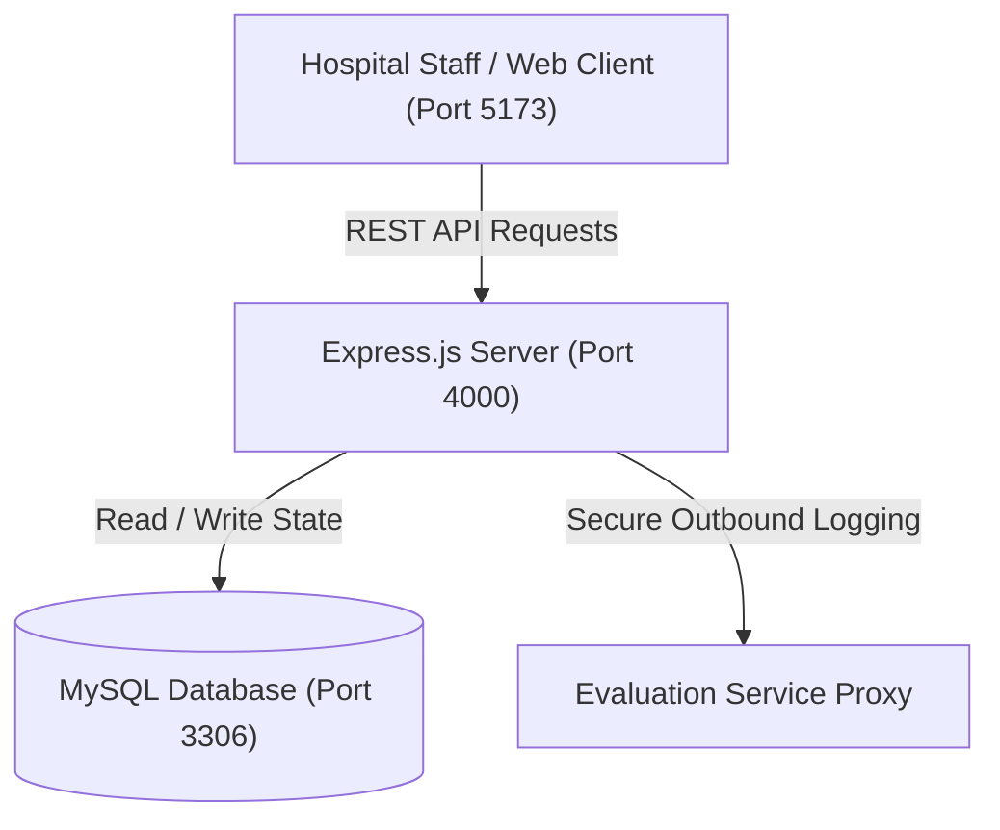
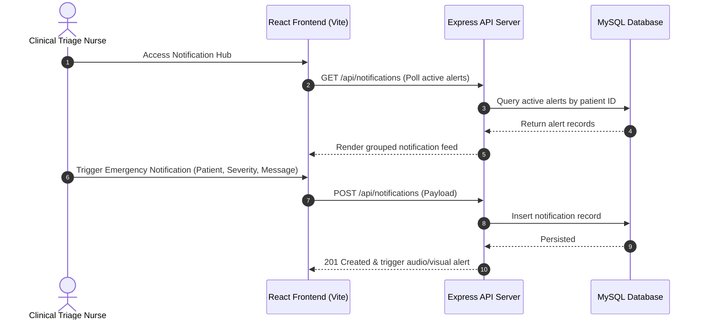

# Afford Notification Hub — Clinical Alert & Event Management System

[]()
[]()
[]()

## Overview
Afford Notification Hub is a specialized healthcare middleware and clinical notification management system. Designed for high-reliability medical event processing, it aggregates patient appointment alerts, emergency practitioner dispatches, and clinical triage updates into a centralized dashboard with zero data loss.

## Features
- **Event-Driven Clinical Alert Pipeline:** RESTful dispatch of urgent medical notifications with priority classification (Emergency, Urgent, Routine).
- **Responsive Web Monitoring Portal:** High-performance React single-page dashboard with real-time alert polling and acknowledgment state tracking.
- **Relational Audit Persistence:** MySQL database schema logging notification dispatches, patient IDs, delivery timestamps, and read states.
- **Evaluation Service Proxy:** Secure backend mediation layer for outbound clinical logging and student evaluation services with token caching.

## Architecture


## User Flow


## Technology Stack
| Layer | Technology | Purpose |
|---|---|---|
| Frontend | React 18, Vite | High-performance clinical triage dashboard |
| Backend | Node.js, Express.js | API routing, alert validation, and evaluation proxying |
| Database | MySQL 8.0, mysql2 | Persistent storage for alert logs and delivery statuses |
| Styling | CSS3 / Responsive Flexbox | Accessible, high-contrast healthcare UI |

## Infrastructure
- **Frontend Development Server:** Port 5173 (Vite HMR)
- **Backend API Gateway:** Port 4000 (Node.js Express)
- **Database Server:** Port 3306 (MySQL 8.0)
- **Networking:** Localhost HTTP with CORS configured for `http://localhost:5173`.

## Project Structure
```text
2300030471affordmedical/
├── backend/
│   ├── src/
│   │   ├── config.js        # Environment and service configuration
│   │   ├── db.js            # MySQL connection pool
│   │   ├── server.js        # Express listener and API route mounting
│   │   └── notificationService.js # Notification business logic
│   ├── .env.example         # Backend environment template
│   └── package.json         # Node.js backend dependencies
├── frontend/
│   ├── src/
│   │   ├── components/      # NotificationList, AlertBadge, Header
│   │   ├── App.jsx          # Root view and polling controller
│   │   └── main.jsx         # React mounting entry
│   ├── index.html           # HTML template
│   ├── .env.example         # Frontend environment template
│   └── vite.config.js       # Vite configuration
├── .gitignore               # Git ignore definitions
└── README.md                # Technical documentation
```

## Prerequisites
- Node.js >= 18.x
- npm >= 9.x
- MySQL Server >= 8.0

## Environment Variables
Create `backend/.env` from `backend/.env.example`:
```env
PORT=4000
HOST=127.0.0.1
CORS_ORIGIN=http://localhost:5173
MYSQL_HOST=127.0.0.1
MYSQL_PORT=3306
MYSQL_USER=your_db_user_here
MYSQL_PASSWORD=your_db_password_here
MYSQL_DATABASE=affordmedical
EVALUATION_API_URL=http://localhost:4000/evaluation-service/notifications
```

## Local Development Setup
1. Clone the repository:
   ```bash
   git clone https://github.com/Bhanutejanallamothu/2300030471affordmedical.git
   cd 2300030471affordmedical
   ```
2. Setup and run Backend:
   ```bash
   cd backend
   npm install
   cp .env.example .env
   npm start
   ```
3. Setup and run Frontend (in a new terminal):
   ```bash
   cd frontend
   npm install
   cp .env.example .env
   npm run dev
   ```
4. Access web application at `http://localhost:5173`.

## Docker Setup
*Not detected in repository. Run directly using Node.js runtime.*

## Database Setup
Log into MySQL CLI:
```sql
CREATE DATABASE affordmedical;
```
Tables are initialized via `backend/src/db.js` on initial connection.

## API Documentation
- `GET /api/notifications` - Retrieve list of recent clinical notifications.
- `POST /api/notifications` - Dispatch a new notification (Requires `patientId`, `type`, `message`).
- `GET /health` - Server healthcheck status.

## Deployment
- **Backend:** Deploy to Render, Railway, or AWS EC2 with Node.js runtime.
- **Frontend:** Build static files (`npm run build`) and deploy `dist/` to Vercel or Netlify.

## Security
- Input sanitization on alert messages to prevent injection attacks.
- Sensitive database and external evaluation endpoints decoupled into environment variables.
- Strict CORS whitelist preventing unauthorized cross-origin requests.

## Testing
Run unit tests:
```bash
cd backend && npm test
```

## Troubleshooting
- **Database Connection Refused:** Verify MySQL service is active on port 3306 and credentials in `.env` match.
- **CORS Errors:** Verify `CORS_ORIGIN` in `backend/.env` matches frontend host `http://localhost:5173`.

## Future Improvements
- WebSocket integration (Socket.io) for instant server push instead of polling.
- SMS and WhatsApp clinical dispatch integrations.

## License
All rights reserved by repository owner.
